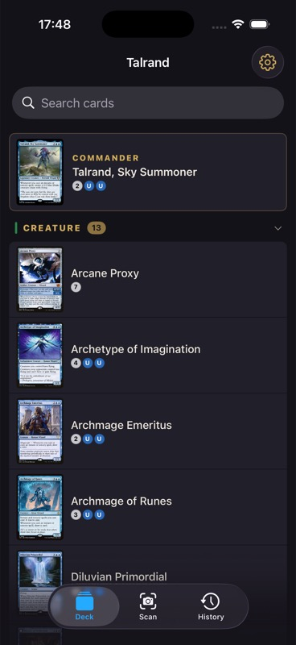

# Talrand

A personal iOS companion app for the [Talrand, Sky Summoner](https://scryfall.com/search?q=talrand+sky+summoner) Commander deck. Built for mid-game quick reference when half your physical cards are in Japanese.

<p align="center">
  
</p>

## Features

- **Card scanner** — point your camera at any card in the deck. Uses Vision framework neural fingerprints (`VNFeaturePrintObservation`) to match against all ~100 cards in sub-millisecond time. Works regardless of card language. Falls back to OCR on collector numbers.
- **Scan feedback** — shows "Maybe: Counterspell?" for near-matches while scanning, with text search fallback for manual lookup.
- **Card detail** — English oracle text, rulings, mana cost, set info. Tap to flip double-faced cards.
- **Swipe navigation** — horizontal swipe between cards in the same category.
- **Card swap** — scan or search for a replacement card via Scryfall, confirm the swap, deck updates in place.
- **Custom card photos** — long-press any card image to replace it with a photo from camera or library.
- **Configurable thumbnails** — compact, normal, or large card thumbnails in the deck list.
- **Offline-first** — all card data and images cached locally after initial sync.

## Stack

SwiftUI · SwiftData · Vision · AVFoundation · Scryfall API

## Requirements

- iOS 26+
- Xcode 16+
- [XcodeGen](https://github.com/yonwoo9/XcodeGen) (the Makefile runs it via `nix shell nixpkgs#xcodegen`)

## Project generation

The Xcode project is generated from `project.yml` by XcodeGen and is **not** committed
(`Talrand.xcodeproj/` is git-ignored). On a fresh clone there is nothing to open in
Xcode until you generate it:

```
cp Local.xcconfig.example Local.xcconfig   # set your DEVELOPMENT_TEAM (kept out of git)
make generate                              # writes Talrand.xcodeproj
open Talrand.xcodeproj
```

Re-run `make generate` after editing `project.yml` or adding/removing files.

## Build & test

```
make build   # authoritative typecheck (iOS Simulator target)
make test    # camera-free OCR + deck-resolution regression suite (also Cmd+U in Xcode)
```

## Setup

The app syncs your deck on first launch. Card images and data are fetched from [Scryfall](https://scryfall.com) (public API, no key required).

## License

[MIT](LICENSE)
